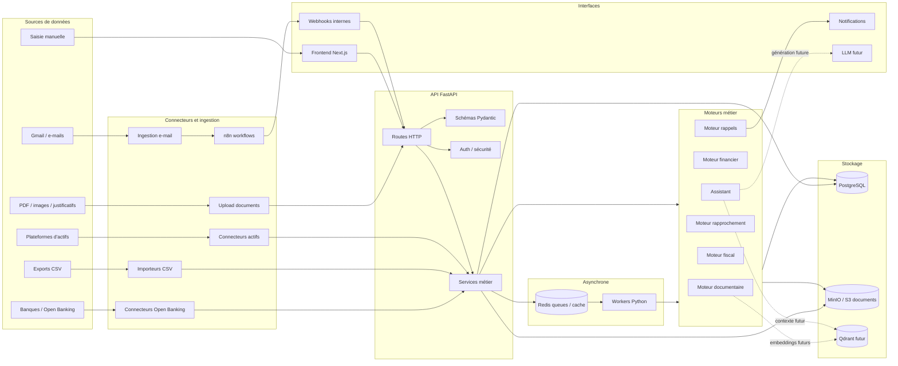

# Architecture Life Pilot

Ce document décrit l'architecture cible de Life Pilot : sources de données, connecteurs, base, moteurs métier, interfaces, séparation des responsabilités et briques futures d'IA.

## Schéma global



## Choix de stack

| Couche | Choix | Rôle |
| --- | --- | --- |
| Frontend | Next.js, TypeScript | Interface utilisateur, appels API, navigation produit. |
| API | Python, FastAPI, Pydantic | Contrats HTTP, validation, orchestration légère des cas d'usage. |
| Workers | Python | OCR, extraction documentaire, imports longs, rapprochements, indexations et tâches planifiées. |
| Base relationnelle | PostgreSQL | Données métier structurées, utilisateurs, transactions, contrats, véhicules, actifs, métadonnées documentaires. |
| File / cache | Redis | Découplage asynchrone, files de jobs, statuts temporaires, cache court terme. |
| Stockage fichiers | MinIO compatible S3 | PDFs, images, exports et documents bruts hors base relationnelle. |
| Automatisation | n8n | Workflows externes, rappels, ingestion e-mail, automatisations planifiées ou webhook. |
| Tests | Pytest, fixtures, tests d'intégration | Validation des services backend, connecteurs, flux document-finance. |
| IA future | Qdrant + LLM | Recherche vectorielle, RAG documentaire, assistant conversationnel enrichi. |

Le choix principal est de garder la logique documentaire, financière et IA côté Python, car l'écosystème Python est plus adapté à l'OCR, au parsing de PDF, au traitement de données et aux pipelines d'embeddings. Le frontend reste en TypeScript afin d'isoler l'expérience utilisateur de la logique métier lourde.

## Structure du dépôt

```text
.
├── apps/
│   ├── api/                 # API FastAPI, services, connecteurs, workers, modèles et schémas
│   └── web/                 # Frontend Next.js
├── database/
│   ├── migrations/          # Migrations SQL versionnées
│   └── seeds/               # Données initiales
├── docs/                    # Documentation technique et décisions d'architecture
├── scripts/                 # Scripts d'import, sauvegarde et restauration
├── tests/
│   ├── fixtures/            # Jeux de données fictifs
│   ├── integration/         # Scénarios bout en bout
│   └── unit/                # Tests unitaires des services et connecteurs
├── workflows/
│   └── n8n/                 # Workflows n8n exportés
├── docker-compose.yml       # Stack locale principale
├── docker-compose.test.yml  # Stack dédiée aux tests
├── package.json             # Scripts monorepo frontend/outillage
└── pnpm-workspace.yaml      # Configuration workspace pnpm
```

## Responsabilités des modules backend

### `apps/api/app/api/routes/`

Expose les endpoints HTTP. Les routes doivent rester minces : validation des entrées, contrôle d'accès, appel aux services, sérialisation de la réponse et déclenchement éventuel d'un job asynchrone. Elles ne doivent pas porter l'OCR, le parsing financier ou la logique de rapprochement.

### `apps/api/app/schemas/`

Définit les contrats Pydantic utilisés par l'API : requêtes, réponses, filtres, statuts et objets de transfert. Cette couche protège le domaine contre les payloads externes invalides.

### `apps/api/app/services/`

Porte les règles métier et l'orchestration applicative : documents, extraction, classification, transactions, comptes, contrats, véhicules, actifs, rappels, notifications, fiscalité, assistant, audit et corrections manuelles.

### `apps/api/app/connectors/`

Isole les dépendances externes : Open Banking, plateformes d'actifs, fournisseurs futurs d'OCR, stockage ou IA. Les services consomment des interfaces métier et ne doivent pas dépendre directement du format d'un fournisseur.

### `apps/api/app/workers/`

Contient les traitements différés : notifications d'expiration, OCR, extraction, imports, rapprochements, indexations et tâches planifiées. Les workers consomment des jobs depuis Redis, exécutent le traitement, persistent le résultat et publient le statut.

### `apps/api/app/models/` et `apps/api/app/db/`

Regroupent la persistance applicative : modèles, sessions de base et accès PostgreSQL. Les migrations SQL restent dans `database/migrations/` pour conserver un historique explicite et reproductible.

### `apps/api/app/core/`

Centralise la configuration, la sécurité et le logging : variables d'environnement, secrets, JWT, chiffrement, configuration applicative et observabilité de base.

### `apps/web/`

Contient l'application Next.js. Elle affiche les tableaux de bord, formulaires, listes et assistants, puis interagit avec l'API via un client HTTP typé. Elle ne parle pas directement à PostgreSQL, Redis, MinIO ou n8n.

### `workflows/n8n/`

Contient les workflows exportés. n8n orchestre les automatisations externes et appelle l'API via des webhooks ou endpoints internes. Il ne devient pas la source de vérité métier.

## Séparation API, workers, n8n et frontend

| Composant | Responsabilité | Ne doit pas faire |
| --- | --- | --- |
| Frontend | Présenter les données, collecter les actions utilisateur, afficher les statuts. | Accéder directement aux bases, secrets ou files Redis. |
| API FastAPI | Authentifier, valider, exposer les ressources, orchestrer les services. | Bloquer une requête sur un OCR, un import massif ou une analyse IA longue. |
| Workers | Exécuter les tâches coûteuses, idempotentes et relançables. | Gérer la présentation ou exposer une API publique. |
| n8n | Automatiser les intégrations, planifications et webhooks externes. | Porter les règles métier centrales ou stocker l'état de référence. |
| PostgreSQL | Stocker l'état métier structuré et transactionnel. | Stocker les fichiers binaires volumineux. |
| MinIO | Stocker les documents bruts et artefacts fichiers. | Remplacer les métadonnées relationnelles ou les règles d'accès. |

## Stratégie asynchrone avec Redis et workers

Les traitements longs suivent un modèle file de jobs :

1. Le frontend appelle l'API pour créer une ressource ou demander une action.
2. L'API valide la demande, écrit l'état initial dans PostgreSQL et stocke le fichier brut dans MinIO si nécessaire.
3. L'API publie un job dans Redis avec un identifiant de corrélation, le type de tâche, l'utilisateur concerné et les références aux données persistées.
4. Un worker consomme le job, exécute le traitement et met à jour PostgreSQL avec le résultat, le statut et les erreurs éventuelles.
5. Le frontend récupère l'avancement via polling API, notification ou événement futur.

Principes attendus :

- les jobs doivent être idempotents ou protégés contre les doubles exécutions ;
- les payloads Redis restent légers et référencent PostgreSQL / MinIO au lieu de transporter des documents complets ;
- les erreurs sont persistées avec un statut lisible par l'utilisateur ;
- les retries sont limités et observables ;
- les traitements prioritaires peuvent être séparés par files dédiées, par exemple `documents`, `imports`, `notifications` et `indexing`.

## Choix de stockage documents

Le stockage documentaire est volontairement séparé en deux niveaux :

- **MinIO / S3** pour les fichiers bruts : PDF, images, exports CSV, pièces justificatives et artefacts issus de l'OCR.
- **PostgreSQL** pour les métadonnées : propriétaire, type de document, statut d'extraction, statut de classification, hash, taille, dates, liens métier, droits d'accès et références d'objet MinIO.

Cette séparation évite de gonfler la base relationnelle avec des binaires volumineux, facilite la sauvegarde/restauration, permet une politique de rétention indépendante et prépare une migration future vers un stockage S3 managé. Les contenus textuels extraits peuvent être conservés en base lorsqu'ils sont utiles aux recherches classiques, tandis que les embeddings futurs seront stockés dans Qdrant.

## Place future de Qdrant et du LLM

Qdrant et le LLM ne sont pas dans le chemin critique initial. Leur place cible est additive :

- **Qdrant** stockera les embeddings de documents, transactions enrichies, contrats, rappels et notes utiles à la recherche sémantique.
- **Le LLM** servira à la synthèse, à l'explication, à l'assistance conversationnelle et à l'aide à la préparation fiscale ou administrative.
- **L'API** restera le point d'entrée unique : elle contrôlera l'authentification, le périmètre utilisateur, les prompts, les outils disponibles et les garde-fous.
- **Les workers** produiront ou mettront à jour les embeddings après extraction documentaire, import financier ou correction manuelle.
- **PostgreSQL** restera la source de vérité ; Qdrant contiendra un index dérivé et reconstructible.

Flux futur typique : document stocké dans MinIO, métadonnées et texte dans PostgreSQL, job `indexing` dans Redis, embedding créé par worker, vecteur écrit dans Qdrant, puis assistant RAG appelé via l'API avec contexte filtré par utilisateur et permissions.

## Conventions d'évolution

- Ajouter une route uniquement si elle délègue à un service testable.
- Ajouter un connecteur uniquement derrière une interface stable ou un service dédié.
- Ajouter un worker pour toute tâche qui risque de dépasser le temps acceptable d'une requête HTTP.
- Ne jamais utiliser n8n comme base métier : les workflows déclenchent ou coordonnent, l'API et PostgreSQL décident et persistent.
- Garder Qdrant et les sorties LLM reconstructibles à partir des sources stockées et des données PostgreSQL.
